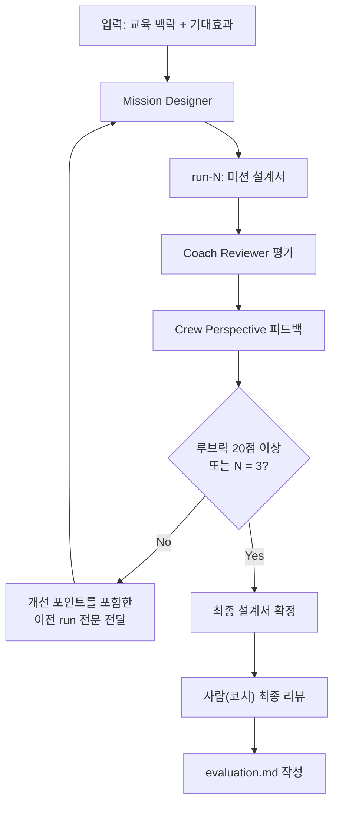

# 실험 01: FE-BE 원정대 미션 설계

## 실험 목표

AI 에이전트가 교육 미션 설계서를 생성하고, 루브릭 기반 평가 → 개선 반복을 통해 "코치가 실제 운영에 쓸 수 있는 수준"까지 품질을 끌어올릴 수 있는지 검증한다.

이 실험은 두 가지를 동시에 확인한다:

1. **에이전트의 교육 설계 역량**: 교육 맥락과 기대효과만으로 실용적인 미션 설계서를 만들 수 있는가?
2. **반복 개선 루프의 유효성**: 코치 관점 + 수강생 관점 리뷰가 실제로 품질 향상을 이끄는가, 아니면 제자리걸음인가?

## 가설

> 교육 목표와 기대효과를 입력으로 주고, 코치 관점(Coach Reviewer) + 수강생 관점(Crew Perspective) 리뷰를 반복하면, **3회 이내에** 루브릭 총점 20점 이상(25점 만점)의 미션 설계서를 생성할 수 있다.

### 가설의 근거

- **3회 제한**: 교육 설계에서 초안 → 동료 리뷰 → 수정 → 최종 확인의 일반적 사이클이 2-3회임. 3회를 초과하면 에이전트 활용의 시간 효율성이 떨어진다.
- **20점 기준**: 루브릭 종합 판정에서 "실험에 바로 사용 가능" 등급의 하한. 5개 차원 평균 4점(대부분 의도적 설계가 반영된 수준).

## 입력

### 교육 맥락

- **대상**: 우아한테크코스 레벨2 크루
  - 프론트엔드 크루 1명 + 백엔드 크루 1명 = 페어
- **시기**: 레벨2 원정대 기간 (약 2주) + 레벨2 남은 기간 (유지보수)
- **전제**: 레벨1에서 JavaScript 기초, 페어프로그래밍, 단위 테스트를 학습 완료
- **참고**: 레벨1 원정대에서 각 크루는 자신의 "송곳"(집중 탐구 주제)을 정해 학습한 경험이 있음

### 미션 개요

프론트엔드 1명 + 백엔드 1명이 페어로 **타인이 사용할 수 있는 웹앱**을 만들어 배포한다.
원정대 기간 중 초기 버전을 배포하고, 레벨2 남은 기간 동안 유지보수/개선한다.

### 기대효과

1. **풀스택 관점 확보**: FE/BE 경계를 넘어 웹 애플리케이션 전체 흐름(요청 → 서버 → DB → 응답 → 렌더링)을 이해한다
2. **이종 직군 협업 역량**: 상대 영역의 제약과 의사결정을 이해하고, API 계약/데이터 흐름 수준에서 기술적 대화를 할 수 있다
3. **TDD/객체지향 실전 경험**: 레벨1에서 학습한 TDD와 객체지향을 FE-BE 통합 환경에서 적용해본다 (특히 FE 크루에게 BE 영역의 TDD/OOP는 새로운 도전)
4. **레벨1 송곳의 연결**: 레벨1 원정대에서 탐구한 "송곳" 주제를 실제 프로덕트에 적용하는 기회를 제공한다

## 실행 계획

### 워크플로우



### 실행 단계

| 단계 | 에이전트 | 입력 | 산출물 | 종료 조건 |
|------|---------|------|--------|-----------|
| 1. 초안 생성 | Mission Designer | 교육 맥락, 기대효과, 에이전트 프롬프트 | `runs/run-01.md` | 미션 설계서 7개 섹션 완성 |
| 2. 평가 | Coach Reviewer → Crew Perspective (순차) | run-01.md + 루브릭 | run-01.md 하단에 리뷰 섹션 추가 | 5개 차원 점수 + 개선 포인트 목록 |
| 3. 개선 | Mission Designer | 이전 run + 리뷰 결과 전문 | `runs/run-02.md` | 각 개선 포인트에 대한 반영 여부 명시 |
| 4. 재평가 | Coach Reviewer → Crew Perspective | run-02.md + 루브릭 | run-02.md 하단에 리뷰 섹션 추가 | 루브릭 20점 이상 또는 3회차 도달 |
| 5. 최종 리뷰 | 사람 (코치 본인) | 최종 run + 전체 이력 | `evaluation.md` | 아래 최종 리뷰 기준 충족 |

### 에이전트 실행 세부사항

- **실행 순서**: Coach Reviewer 먼저, Crew Perspective 다음. Coach가 구조적 문제를 잡고, Crew가 수강생 체감 문제를 보완한다.
- **리뷰 결과 통합**: 두 에이전트의 리뷰를 하나의 run 파일에 순서대로 기록한다. 별도 통합 작업 없이, Mission Designer가 다음 회차에서 두 리뷰를 모두 참고한다.
- **개선 반영 방식**: Mission Designer에게 이전 run 전문(미션 설계 + 리뷰 결과 포함)을 입력으로 전달한다. 개선된 run 파일 상단에 `## 변경 사항` 섹션으로 이전 리뷰 대비 변경 내역을 명시한다.
- **조기 종료**: 2회차에서 20점 이상 달성 시 3회차를 생략하고 최종 리뷰로 진행한다.
- **변수 통제**: 각 run 파일에 사용한 모델명과 에이전트 프롬프트 버전을 기록한다.

### run 파일 구조

각 run 파일(`runs/run-{N}.md`)은 아래 구조를 따른다:

```
# Run {N}: FE-BE 원정대 미션 설계

## 메타
- 모델: {모델명}
- 에이전트 프롬프트 버전: {커밋 해시 또는 날짜}
- 이전 run: {있으면 run 번호, 없으면 "없음 (초안)"}

## 변경 사항 (run-02부터)
- 이전 리뷰 개선 포인트 → 반영 여부

## 미션 설계서
(Mission Designer 출력: 7개 섹션)
1. 미션 개요
2. 단계별 구성
3. 요구사항
4. 협업 규칙
5. 기술 제약과 자율 영역
6. 유지보수 가이드
7. 평가 기준

---

## Coach Reviewer 평가
(루브릭 기반 5개 차원 점수 + 개선 포인트)

## Crew Perspective 피드백
(수강생 관점 체크리스트 + 걱정/기대)
```

### 루브릭-에이전트 역할 매핑

| 루브릭 차원 | 주요 평가 에이전트 | 보조 평가 에이전트 |
|------------|-------------------|-------------------|
| 1. 협업 구조의 현실성 | Coach Reviewer | Crew Perspective (협업 걱정) |
| 2. 학습 목표 달성 가능성 | Coach Reviewer | - |
| 3. 단계 설계의 적절성 | Coach Reviewer | Crew Perspective (이해도, 불안) |
| 4. 요구사항의 구체성과 자율성 균형 | Crew Perspective (이해도, 동기) | Coach Reviewer |
| 5. 유지보수 경험의 실질성 | Coach Reviewer | Crew Perspective (성장 기대) |

## 평가 기준

- 루브릭: [rubrics/expedition-mission-design.md](../../rubrics/expedition-mission-design.md)
- 종합 목표: **20점 이상 / 25점 만점** (5개 차원 각 5점, "실험에 바로 사용 가능" 등급)
- 최대 반복 횟수: **3회**
- 단일 차원 최저: **어떤 차원도 2점 이하가 아닐 것** (한 차원이 극단적으로 낮으면 총점이 높아도 실용성이 떨어짐)

> **Note**: 루브릭의 "학습 목표 달성 가능성" 차원 체크리스트는 본 문서의 기대효과 4개 항목에 맞춰 갱신이 필요하다. 실험 실행 전 루브릭 체크리스트를 아래 기대효과와 동기화할 것.
> 1. 풀스택 관점 확보
> 2. 이종 직군 협업 역량
> 3. TDD/객체지향 실전 경험
> 4. 레벨1 송곳의 연결

## 성공 판정

이 실험이 "성공"이란:

1. **정량 - 루브릭 점수**: 3회 이내에 루브릭 20점 이상 달성하고, 모든 차원이 3점 이상
2. **정성 - 운영 가능성**: 코치(본인)가 "이 설계서를 기반으로 실제 미션을 운영할 수 있겠다"고 판단. 구체적으로:
   - 크루에게 그대로 전달해도 "뭘 해야 하는지" 이해할 수 있는가?
   - 코치가 추가로 보충 설명 없이 미션을 시작할 수 있는가?
   - 기간 내 완료 가능한 분량인가?
3. **프로세스 - 개선 유효성**: 회차 간 총점이 증가하고, 이전 리뷰에서 지적된 개선 포인트가 실제로 반영됨

## 최종 리뷰 (evaluation.md) 기록 항목

코치가 최종 run을 검토한 후 `evaluation.md`에 기록할 내용:

1. **실험 결과 요약**: 총 회차, 최종 루브릭 점수, 성공/실패 판정
2. **회차별 점수 추이**: 각 차원의 점수 변화 (개선이 유효했는지)
3. **운영 가능성 판단**: 성공 판정 2번(정성) 3개 질문에 대한 답변
4. **에이전트별 기여도**: 각 에이전트가 실제로 유용했던 부분과 한계
5. **인사이트**: 다음 실험에 반영할 교훈 (루브릭, 프롬프트, 워크플로우 관련)
6. **실패 분석** (해당 시): 아래 실패 분석 프레임 기반

## 실패 시 분석 프레임

실험이 목표에 도달하지 못할 경우, 아래 분류로 원인을 분석한다:

| 실패 유형 | 증상 | 다음 단계 |
|-----------|------|-----------|
| 루브릭 문제 | 점수는 높은데 코치가 "이건 못 쓰겠다" 판단 | 루브릭 차원 추가/수정 후 실험 재설계 |
| 프롬프트 문제 | 특정 차원이 반복적으로 낮음 | 해당 차원에 대한 에이전트 프롬프트 보강 |
| 반복 무효 | 회차 간 점수 변화 없음 또는 하락 | 리뷰 → 개선 전달 방식 재설계 |
| 입력 부족 | 에이전트가 교육 맥락을 충분히 이해 못함 | inputs/에 참고 자료 추가 (기존 미션 예시 등) |
| 구조적 한계 | 에이전트가 특정 영역을 원천적으로 못 다룸 | 사람 개입 지점 정의, 하이브리드 워크플로우 설계 |
